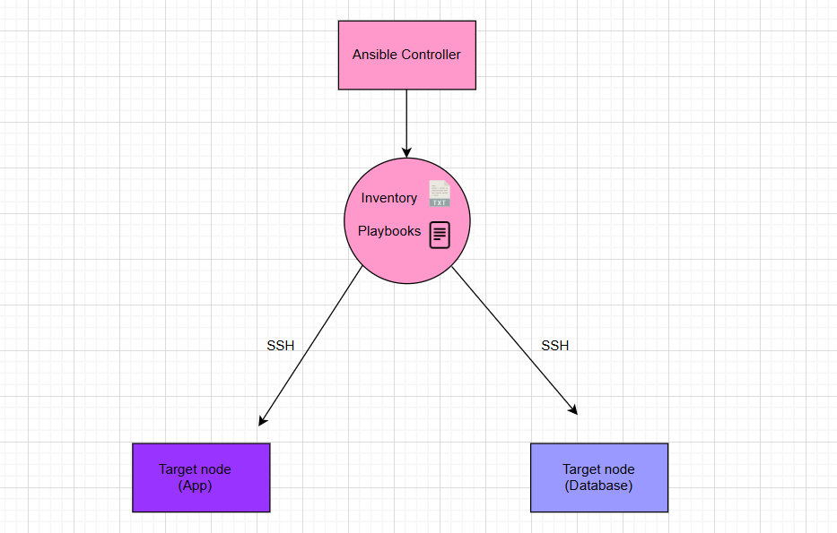

# Ansible Research

## Infrastructure as Code (IaC)
- The ability to provision and manage computing infrastructure using code instead of manual processes.
- Define the desired state without specifying the steps to get there.
- Developers can focus on building and improving applications instead of managing environments.
- IaC helps control costs, reduce risks, and respond quickly to new business opportunities.

## Benefits of Infrastructure as Code
- **Automation**: Reduces manual intervention.
- **Easily duplicate an environment**: Deploy the same configuration across multiple locations.
- **Reduce configuration errors**: Streamlines error checking.
- **Iterate on best-practice environments**: Quickly update and refine configurations.

### Tools Used for IaC
- **Puppet**: Suitable for large-scale deployments.
- **Ansible**: Agentless and widely adopted.
- **Salt**: Another configuration management solution.
- **Chef**: Uses a Ruby-based DSL for defining infrastructure.

## Configuration Management (CM)
- Tracks and manages IT resources, applications, and services.
- Ensures that components work together efficiently.
- Identifies changes made to a system.
- Manages changes to baselines.

### CM Tools
- **Version control systems**: Track and manage software changes (e.g., Git).
- **Specialized CM platforms**: Tools like Puppet, Ansible, and Chef.

## Infrastructure Provisioning
- The process of setting up IT infrastructure, including hardware, networks, and storage.
- **Steps in infrastructure provisioning**:
  - **Prepare**: Define infrastructure needs.
  - **Assign**: Allocate resources.
  - **Activate**: Deploy and configure infrastructure.

## Ansible
- A free, open-source automation tool for configuring systems, deploying software, and managing infrastructure.
- Written in Python.
- Part of configuration management and orchestration solutions.

### Companies Using Ansible
- **Tech**: Amazon, Red Hat, IBM.
- **Finance**: JP Morgan, Goldman Sachs.
- **Healthcare**: Pfizer, Novartis, GSK.

## Silencing Error Messages in Ansible
1. Open the configuration file:
   ```bash
   sudo nano ansible.cfg
   ```
2. Add the following lines:
   ```ini
   [defaults]
   interpreter_python=auto_silent
   ```
3. Save and exit (`CTRL+X`, `Y`, `Enter`).

## Ad-hoc Commands in Ansible
- Uses the `/usr/bin/ansible` command-line tool to automate single tasks.
- Not reusable but quick for simple tasks.
- Useful for rarely performed tasks, e.g., shutting down machines before holidays.

### Why Is `ping` an Ad-hoc Command?
- Runs instantly without a playbook.
- Does not change system state or configuration.
- Used for quick connectivity tests.

### What Happens If No Module Is Specified?
- Ansible defaults to using the **command** module.
- However, this module does not support shell features like pipes (`|`) or environment variables (`$HOME`).

### Advantages and Disadvantages of Using the `command` Module

#### **Advantages**
| Advantage | Description |
|-----------|-------------|
| Default Module | Used automatically if no module is specified. |
| Secure Execution | Avoids shell injection risks. |
| Lightweight | Fast execution without additional overhead. |
| Cross-Platform | Works across Linux and Unix systems. |

#### **Disadvantages**
| Disadvantage | Description |
|-------------|-------------|
| No Shell Features | Cannot use shell operators like pipes (`|`). |
| Cannot Use Built-in Shell Commands | Commands like `cd` do not persist. |
| Less Flexible | If shell features are needed, `shell` module must be used. |

## Methods to Perform `apt update` and `apt upgrade` in Ansible

### **Method 1: Using the `command` Module**
```bash
ansible app -m command -a "sudo apt-get update"
ansible app -m command -a "sudo apt-get upgrade -y"
```
- Runs system commands directly.
- Does not support chaining (`&&`).
- Not idempotent (executes every time).

### **Method 2: Using the `shell` Module**
```bash
ansible app -m shell -a "sudo apt-get update && sudo apt-get upgrade -y"
```
- Supports chaining (`&&`).
- Less secure than `command`.

### **Method 3: Using the `apt` Module (Best Practice)**
```bash
ansible app -m apt -a "update_cache=yes upgrade=dist" --become
```
- Ensures updates only run when necessary.
- More reliable and secure.

### **Comparison Table**
| Method  | Supports `&&` | Secure | Idempotent | Recommended |
|---------|--------------|--------|------------|-------------|
| `command` | No | Yes | No | No |
| `shell` | Yes | No | No | No |
| `apt` | Yes | Yes | Yes | **Yes (best practice)** |

## Copying a Private Key to a Target Node Using Ansible

### **Steps**
1. Verify the key exists on the controller:
   ```bash
   ls -l ~/.ssh/tech501-maram-key-2.pem
   ```
2. Ensure the `.ssh` directory exists on the target:
   ```bash
   ansible ec2-instance-app -m file -a "path=/home/ubuntu/.ssh state=directory mode=0700 owner=ubuntu group=ubuntu" --become
   ```
3. Copy the key:
   ```bash
   ansible ec2-instance-app -m copy -a "src=/home/ubuntu/.ssh/tech501-maram-key-2.pem dest=/home/ubuntu/.ssh/tech501-maram-key-2.pem mode=0600 owner=ubuntu group=ubuntu" --become
   ```
4. Verify the key exists on the target:
   ```bash
   ansible ec2-instance-app -m shell -a "ls -l ~/.ssh"
   ```

## Summary
- Ensured `.ssh` directory exists.
- Copied the key securely with correct permissions.
- Verified the key transfer.





---
This playbook ensures that the target nodes have an up-to-date system and Nginx installed, following best practices in Ansible automation.
---
# Ansible Playbook: Provision App VM and Run Application

## Overview
This playbook installs Node.js, clones an application from GitHub, installs dependencies, seeds the database, and starts the application on the target node.

### **Filename**: `prov_app_with_npm_start.yml`

## **Playbook**
```yaml
- name: Install app dependencies and run app
  hosts: web
  gather_facts: yes
  become: yes

  tasks:
    - name: Install Node.js 18 and npm
      ansible.builtin.shell: |
        curl -fsSL https://deb.nodesource.com/setup_18.x | sudo -E bash -
        apt-get install -y nodejs
      args:
        executable: /bin/bash

    - name: Install npm
      ansible.builtin.apt:
        name: npm
        state: present

    - name: Clone the app from GitHub
      ansible.builtin.git:
        repo: "https://github.com/marmari9/tech501-sparta-app.git"
        dest: /home/ubuntu/tech501-sparta-app
        version: main  # Change branch name if needed
        force: yes

    - name: Install app dependencies without running seed script
      ansible.builtin.command:
        cmd: npm install --ignore-scripts
        chdir: /home/ubuntu/tech501-sparta-app

    - name: Manually seed the database
      ansible.builtin.command:
        cmd: node seeds/seed.js
        chdir: /home/ubuntu/tech501-sparta-app

    - name: Start the app with npm
      ansible.builtin.command:
        cmd: npm start
        chdir: /home/ubuntu/tech501-sparta-app

    - name: Allow traffic on port 3000
      ansible.builtin.iptables:
        chain: INPUT
        protocol: tcp
        destination_port: 3000
        jump: ACCEPT
```

## **Explanation of Commands**
- **Installs Node.js 18** (or change to Node.js 20 if required).
- **Clones the app from GitHub** to the target node.
- **Installs dependencies without triggering `seed.js` automatically.**
- **Manually seeds the database** after dependency installation.
- **Starts the application using `npm start`.**
- **Ensures port 3000 is open** for external access.

## **How to Run the Playbook**
Execute the playbook from the **Ansible controller**:
```bash
ansible-playbook prov_app_with_npm_start.yml
```

## **Verification**
After running the playbook, confirm that the app is running:
```bash
ansible web -m shell -a "curl http://localhost:3000"
```
If the app is running correctly, it should return an expected response.


# Set up Ansible controller and the target nodes (app and db): 


## Set up dependincies on the controller instance:
- 1. SSH to the controller instance:
```bash
ssh -i path/to/private/key ubuntu@< Controller Public IP >
```

- 2. Install Ansible using the following commands:

```bash 
sudo apt update 
sudo apt-add-repository -y ppa:ansible/ansible  # updates and upgrade packages

sudo apt-get -y install ansible

ansible --version  # check the ansible versio

cd /etc/ansible   # on this dir there are the hosts, ansible.cfg,roles
```

# Copying a Private Key to the Target Node using Ansible

## Task Overview
Copy the private key <private-key> from the controller to the target node (`ec2-instance-app`) inside the `.ssh` directory and set the correct permissions.

## Steps

### 1️. Verify the Private Key Exists on the Controller
Run the following command on the **controller** to ensure the key exists:
```bash
ls -l ~/path/to/private/key
```
If the file exists, proceed to the next step.

### 2️. Ensure the `.ssh` Directory Exists on the Target
Create the `.ssh` directory on the **target node** if it does not exist:
```bash
ansible ec2-instance-app -m file -a "path=/home/ubuntu/.ssh state=directory mode=0700 owner=ubuntu group=ubuntu" --become
```

### 3️. Copy the Private Key to the Target Node
Use the `copy` module to transfer the key file:
```bash
ansible ec2-instance-app -m copy -a "src=/home/ubuntu/path/to/private/key dest=/home/ubuntu/.ssh/<private-key> mode=0600 owner=ubuntu group=ubuntu" --become
```

### 4️. Verify the Key is Copied Successfully
Check if the file exists on the target node:
```bash
ansible ec2-instance-app -m shell -a "ls -l ~/.ssh"
```
Expected output:
```
-rw------- 1 ubuntu ubuntu  401 Feb 28 11:16 authorized_keys
-rw------- 1 ubuntu ubuntu 1679 Mar  3 15:59 tech501-maram-key-2.pem
```

## Summary
- Verified the private key exists on the controller.
- Ensured the `.ssh` directory exists on the target node.
- Copied the key using Ansible’s `copy` module with proper permissions.
- Verified that the key was successfully copied.

This method ensures a **secure and automated** way to transfer SSH keys between servers.

------------------

#
- change the hosts file
```bash
sudo nano hosts

[web]
ec2-instance-app ansible_host=34.255.124.208 ansible_user=ubuntu ansible_private_key_file=~/.ssh/tech501-maram-key-2.pem              # update the <public IP address>
```

- error message with ping:


- error message with IP address added of the target node:


- successful ping with a pong reply:


- removed the error message:


- to silence the error message:

```bash
sudo nano ansible.cfg
``` 
- add this to the file:
  - [defaults]
    - interpreter_python=auto_silent
    - ctrl x + y + enter

## Update and upgrade target nodes using the ad hoc commands:

# Three Methods to Perform `apt update` and `apt upgrade` in Ansible

## Method 1: Using the `command` Module
This method runs commands without a shell. It does not support command chaining (`&&`) or environment variables.

### Command:
```bash
ansible app -m command -a "sudo apt-get update"
ansible app -m command -a "sudo apt-get upgrade -y"
```

### Differences:
- Runs system commands directly.
- Does not support `&&`, so each command must be run separately.
- More secure since it does not invoke a shell.
- Not idempotent; runs every time regardless of updates.

---

## Method 2: Using the `shell` Module
This method allows using a shell, which means it supports `&&`, pipes, and variables.

### Command:
```bash
ansible app -m shell -a "sudo apt-get update && sudo apt-get upgrade -y"
```
or using `--become`:
```bash
ansible app -m shell -a "apt-get update && apt-get upgrade -y" --become
```

### Differences:
- Supports shell-specific features like `&&`, pipes, and variables.
- Less secure because it runs inside a shell.
- Not idempotent; it executes every time.
- Useful when multiple commands need to run in one line.

---

## Method 3: Using the `apt` Module (Best Practice)
The `apt` module is designed specifically for Debian-based systems and is idempotent.

### Command:
```bash
ansible app -m apt -a "update_cache=yes upgrade=dist" --become
```

### Differences:
- Ensures updates only run when necessary (idempotent).
- More reliable and readable than using raw shell commands.
- Secure and does not require `sudo` inside the command.
- Recommended for production and automation.

---

## Comparison Table

| Method  | Supports `&&` | Secure | Idempotent | Recommended |
|---------|--------------|--------|------------|-------------|
| `command` | No | Yes | No | No |
| `shell` | Yes | No | No | No |
| `apt` | Yes | Yes | Yes | Yes (best practice) |

For production, the `apt` module is the best choice as it ensures efficient and secure package management.


---
# Ansible Playbook: Install Nginx on Target Nodes


This playbook installs and configures **Nginx** on target nodes belonging to the `web` group. It ensures that the system is updated before installing Nginx.

### **Filename**: `install_nginx.yml`

## **Playbook Structure**
```yaml
- name: install nginx play
  hosts: web
  gather_facts: yes
  become: yes  # Grants admin access (equivalent to sudo)

  tasks:
    - name: Update apt cache
      ansible.builtin.apt:
        update_cache: yes  # Refreshes the package list

    - name: Upgrade all packages
      ansible.builtin.apt:
        upgrade: dist  # Upgrades all installed packages

    - name: Install and configure nginx
      ansible.builtin.apt:
        name: nginx  # Installs Nginx
        state: present  # Ensures it is installed
```

## **Explanation of Commands**
### **1️. Play Definition**
```yaml
- name: install nginx play
  hosts: web
  gather_facts: yes
  become: yes
```
- **`name`** → Descriptive name for the play.
- **`hosts: web`** → Runs the play on all machines in the `web` inventory group.
- **`gather_facts: yes`** → Collects system information (useful for conditionals in playbooks).
- **`become: yes`** → Grants admin privileges (`sudo`) for all tasks.

### **2️. Updating the Package Cache**
```yaml
    - name: Update apt cache
      ansible.builtin.apt:
        update_cache: yes
```
- **`update_cache: yes`** → Runs `apt update`, refreshing the package list.

### **3️. Upgrading All Installed Packages**
```yaml
    - name: Upgrade all packages
      ansible.builtin.apt:
        upgrade: dist
```
- **`upgrade: dist`** → Runs `apt dist-upgrade`, ensuring all installed packages are updated.

### **4️. Installing and Configuring Nginx**
```yaml
    - name: Install and configure nginx
      ansible.builtin.apt:
        name: nginx
        state: present
```
- **`name: nginx`** → Specifies that Nginx should be installed.
- **`state: present`** → Ensures that Nginx is installed and not removed.

## **How to Run the Playbook**
Execute the playbook from the **Ansible controller**:
```bash
ansible-playbook install_nginx.yml
```

## **Verification**
After running the playbook, confirm that Nginx is installed and running:
```bash
ansible web -m shell -a "systemctl status nginx"
```
If Nginx is running, you should see output indicating that the service is **active**.

- nginnx is active and running on the target app node:


# Ansible Playbook: Provision app instance:

### Filename: prov_app_with_pm2.yml:

```yml
---
- name: Install app dependencies and run app with PM2
  hosts: web
  gather_facts: yes
  become: yes

  tasks:
    - name: Install required system packages
      ansible.builtin.apt:
        name:
          - curl
          - git
        state: present
        update_cache: yes

    - name: Install Node.js 20 and npm
      ansible.builtin.shell: |
        curl -fsSL https://deb.nodesource.com/setup_20.x | sudo -E bash -
        apt-get install -y nodejs
      args:
        executable: /bin/bash

    - name: Install PM2 globally
      community.general.npm:
        name: pm2
        global: yes

    - name: Ensure PM2 directory exists for ubuntu user
      ansible.builtin.file:
        path: /home/ubuntu/.pm2
        state: directory
        owner: ubuntu
        group: ubuntu
        mode: '0755'

    - name: Clone the app repository from GitHub
      ansible.builtin.git:
        repo: "https://github.com/marmari9/tech501-sparta-app.git"
        dest: /home/ubuntu/app
        version: main
        force: yes

    - name: Install app dependencies
      ansible.builtin.command:
        cmd: npm install
        chdir: /home/ubuntu/app

    - name: Set DB_HOST environment variable (Permanent)
      ansible.builtin.lineinfile:
        path: /etc/environment
        line: 'DB_HOST=mongodb://172.31.55.4:27017/posts'
        create: yes

    - name: Reload system-wide environment variables
      ansible.builtin.shell: "export $(cat /etc/environment | xargs)"
      args:
        executable: /bin/bash
    - name: Seed the database automatically
      ansible.builtin.shell: "node seeds/seed.js"
      args:
        chdir: /home/ubuntu/app
      become_user: ubuntu

    - name: Start the app with PM2
      ansible.builtin.shell: |
        pm2 delete tech501-sparta-app || true
        pm2 start npm --name tech501-sparta-app -- start
        pm2 save
      args:
        chdir: /home/ubuntu/app
      become_user: ubuntu

    - name: Enable PM2 on system startup
      ansible.builtin.shell: |
        env PATH=$PATH:/usr/bin pm2 startup systemd -u ubuntu --hp /home/ubuntu
      args:
        executable: /bin/bash
      become: yes

    - name: Allow traffic on port 3000
      ansible.builtin.iptables:
        chain: INPUT
        protocol: tcp
        destination_port: 3000
        jump: ACCEPT
```

# Task: print facts playbook:
```yml
---
- name: Print gathered facts
  hosts: all
  gather_facts: yes

  tasks:
    - name: Print all facts
      ansible.builtin.debug:
        var: ansible_facts
```


- print facts about the app target node:

  


# Create Database target node:


# Update and upgrade the app and database target nodes:

```yml 
---
- name: Update and Upgrade Packages on Web and DB
  hosts: web, db
  become: yes
  tasks:
    - name: Update package cache
      ansible.builtin.apt:
        update_cache: yes

    - name: Upgrade all packages
      ansible.builtin.apt:
        upgrade: full

    - name: Autoremove unnecessary packages
      ansible.builtin.apt:
        autoremove: yes
```


  


# Create a playbook to install mongoDB:

```yml 
---
- name: Install app dependencies and run app
  hosts: db
  become: yes
  tasks:
    - name: Import the MongoDB public key
      ansible.builtin.apt_key:
        url: https://pgp.mongodb.com/server-7.0.asc
        state: present

    - name: Add the MongoDB repository
      ansible.builtin.apt_repository:
        repo: "deb [ arch=amd64,arm64 ] https://repo.mongodb.org/apt/ubuntu {{ ansible_facts['distribution_release'] }}/mongodb-org/7.0 multiverse"
        state: present
        filename: mongodb-org-7.0

    - name: Install MongoDB 7.0
      ansible.builtin.apt:
        name: mongodb-org
        state: present
        update_cache: yes
```


# Create a playbook that create the app and db :
```yml 
---
- import_playbook: prov-db.yml
- import_playbook: prov_app_with_pm2.yml
```


- App web page and post page working on port 3000:


- On the install_nginx.yml file update it to include the following to set the reverse proxy:

```yml
    - name: Create Nginx reverse proxy configuration
      ansible.builtin.copy:
        dest: /etc/nginx/sites-available/app
        content: |
          server {
              listen 80;
              server_name _;

              location / {
                  proxy_pass http://localhost:3000/;
              }
          }
      notify: Restart Nginx

    - name: Enable the new Nginx configuration
      ansible.builtin.file:
        src: /etc/nginx/sites-available/app
        dest: /etc/nginx/sites-enabled/app
        state: link
      notify: Restart Nginx
```


