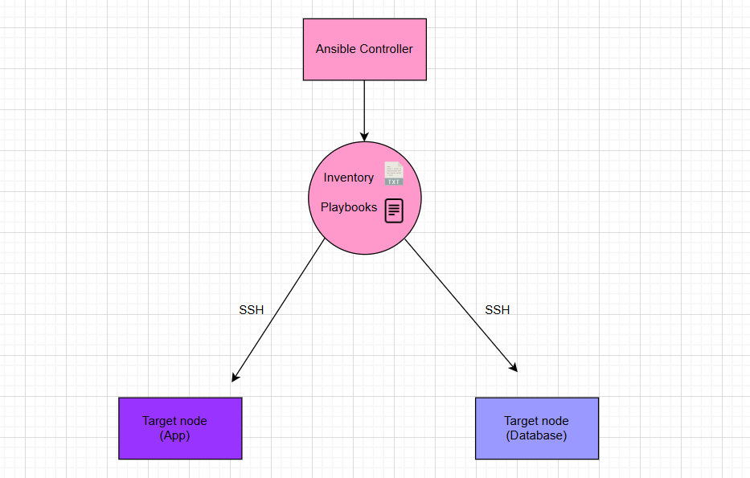

# Ansible Research

## Infrastructure as Code (IaC)
- The ability to provision and manage computing infrastructure using code instead of manual processes.
- Define the desired state without specifying the steps to get there.
- Developers can focus on building and improving applications instead of managing environments.
- IaC helps control costs, reduce risks, and respond quickly to new business opportunities.

## Benefits of Infrastructure as Code
- **Automation**: Reduces manual intervention.
- **Easily duplicate an environment**: Deploy the same configuration across multiple locations.
- **Reduce configuration errors**: Streamlines error checking.
- **Iterate on best-practice environments**: Quickly update and refine configurations.

## When & Where to Use IaC
- **Cloud Environments**: Automating AWS, Azure, and GCP infrastructure.
- **Hybrid & Multi-Cloud**: Ensuring consistency across platforms.
- **DevOps Pipelines**: CI/CD automation for infrastructure deployment.
- **Disaster Recovery**: Quickly redeploy environments in case of failures.
- **Scalability**: Automating infrastructure scaling based on demand.

## Tools Used for IaC
- **Terraform**: Declarative infrastructure provisioning tool.
- **Puppet**: Suitable for large-scale deployments.
- **Ansible**: Agentless and widely adopted.
- **Salt**: Another configuration management solution.
- **Chef**: Uses a Ruby-based DSL for defining infrastructure.

## Configuration Management (CM)
- Tracks and manages IT resources, applications, and services.
- Ensures that components work together efficiently.
- Identifies changes made to a system.
- Manages changes to baselines.

### CM Tools
- **Version control systems**: Track and manage software changes (e.g., Git).
- **Specialized CM platforms**: Tools like Puppet, Ansible, and Chef.

## Infrastructure Provisioning
- The process of setting up IT infrastructure, including hardware, networks, and storage.
- **Steps in infrastructure provisioning**:
  - **Prepare**: Define infrastructure needs.
  - **Assign**: Allocate resources.
  - **Activate**: Deploy and configure infrastructure.
- Some **CM tools like Ansible and Puppet** also handle infrastructure provisioning.

## Ansible Overview

### Nodes & Modules
- Ansible connects to **nodes (hosts)** and pushes out small programs called **modules**.
- Nodes are target endpoints like servers, network devices, or computers.

### Modules
- Perform automation tasks by defining the desired system state.
- Executed by Ansible and removed afterward.
- Without modules, tasks would require ad-hoc commands or scripts.

### Built-in & Custom Modules
- Ansible includes built-in modules for common tasks.
- Custom modules can be created in any language that returns JSON (e.g., Python, Ruby).

### Agentless Architecture
- No software installation required on managed nodes.
- Ansible reads target machines from an **inventory file** (default or custom).

### Connection & Authentication
- Uses **SSH protocol** to connect and run tasks.
- Default authentication via **SSH keys with ssh-agent**.
- No root login required; can use **su or sudo** as any user.

### Execution & Playbooks
- Transfers necessary modules to remote machines for execution.
- Uses **human-readable YAML templates** to automate repetitive tasks.

## Who is Using IaC & Ansible

### Companies Using IaC
- **Tech**: Amazon, Google, Microsoft.
- **Finance**: JPMorgan Chase, Goldman Sachs.
- **Healthcare**: Pfizer, Novartis, GSK.
- **Retail**: Walmart, Target, eBay.

### Companies Using Ansible
- **Tech**: Red Hat, IBM, Facebook.
- **Finance**: Bank of America, Capital One.
- **Healthcare**: CVS Health, UnitedHealth Group.
- **Automotive**: Tesla, Ford, General Motors.

## Ad-hoc Commands in Ansible
- Uses the `/usr/bin/ansible` command-line tool to automate single tasks.
- Not reusable but quick for simple tasks.
- Useful for rarely performed tasks, e.g., shutting down machines before holidays.

### Why Is `ping` an Ad-hoc Command?
- Runs instantly without a playbook.
- Does not change system state or configuration.
- Used for quick connectivity tests.

### What Happens If No Module Is Specified?
- Ansible defaults to using the **command** module.
- However, this module does not support shell features like pipes (`|`) or environment variables (`$HOME`).

### Advantages and Disadvantages of Using the `command` Module

#### **Advantages**
| Advantage | Description |
|-----------|-------------|
| Default Module | Used automatically if no module is specified. |
| Secure Execution | Avoids shell injection risks. |
| Lightweight | Fast execution without additional overhead. |
| Cross-Platform | Works across Linux and Unix systems. |

#### **Disadvantages**
| Disadvantage | Description |
|-------------|-------------|
| No Shell Features | Cannot use shell operators like pipes (`|`). |
| Cannot Use Built-in Shell Commands | Commands like `cd` do not persist. |
| Less Flexible | If shell features are needed, `shell` module must be used. |

---

## Overview of using Ansible in creating a two-tier Architecture:


   


# Creating EC2 Instances for Ansible

This section outlines the steps to create and configure EC2 instances for Ansible, including the controller, application node, and database node.

## 1. Create the Ansible Controller Instance

### **Instance Details**
- **Name**: `tech501-maram-ubuntu-2204-ansible-controller`
- **Instance Type**: `t3.micro`
- **Security Group**: Allow SSH (port 22)
- **Key Pair**: Use the existing AWS key pair
- **AMI**: `Ubuntu Server 22.04 LTS` 
- **User Data**: Leave it blank 

## 2. Create the Application Target Node Instance

### **Instance Details**
- **Name**: `tech501-maram-ubuntu-2204-ansible-target-node-app`
- **Instance Type**: `t3.micro`
- **Security Group**: Allow SSH (port 22), HTTP (port 80), and port 3000
- **Key Pair**: Use the same AWS key pair as the controller
- **AMI**: `Ubuntu Server 22.04 LTS`
- **User Data**: Leave it blank 

## 3. Create the Database Node Instance

### **Instance Details**
- **Name**: `tech501-maram-ubuntu-2204-ansible-node-db`
- **Instance Type**: `t3.micro`
- **Security Group**: Same as usual for a database (allow SSH and MongoDB ports as needed)
- **Key Pair**: Use the same AWS key pair as the controller and application node
- **AMI**: `Ubuntu Server 22.04 LTS`
- **User Data**: Leave it blank

## 4. Verify SSH Access
After launching the instances, verify that you can SSH into each machine:
```bash
ssh -i ~/.ssh/your-key.pem ubuntu@your-controller-ip
ssh -i ~/.ssh/your-key.pem ubuntu@your-app-node-ip
ssh -i ~/.ssh/your-key.pem ubuntu@your-db-node-ip
```

## Set up dependincies on the controller instance:
- 1. SSH to the controller instance:
```bash
ssh -i path/to/private/key ubuntu@< Controller Public IP >
```

- 2. Install Ansible using the following commands:

```bash 
sudo apt update 
sudo apt-add-repository -y ppa:ansible/ansible  # updates and upgrade packages

sudo apt-get -y install ansible

ansible --version  # check the ansible versio

cd /etc/ansible   # on this dir there are the hosts, ansible.cfg,roles
```

## Copying a Private Key to the Target Node using Ansible

## Task Overview
Copy the private key <private-key> from the controller to the target node (`ec2-instance-app`) inside the `.ssh` directory and set the correct permissions.

## Steps

### 1️. Verify the Private Key Exists on the Controller
Run the following command on the **controller** to ensure the key exists:
```bash
ls -l ~/path/to/private/key
```
If the file exists, proceed to the next step.

### 2️. Ensure the `.ssh` Directory Exists on the Target
Create the `.ssh` directory on the **target node**:
```bash
ansible ec2-instance-app -m file -a "path=/home/ubuntu/.ssh state=directory mode=0700 owner=ubuntu group=ubuntu" --become
```

### 3️. Copy the Private Key to the Target Node
Use the `copy` module to transfer the key file:
```bash
ansible ec2-instance-app -m copy -a "src=/home/ubuntu/path/to/private/key dest=/home/ubuntu/.ssh/<private-key> mode=0600 owner=ubuntu group=ubuntu" --become
```

### 4️. Verify the Key is Copied Successfully
Check if the file exists on the target node:
```bash
ansible ec2-instance-app -m shell -a "ls -l ~/.ssh"
```
Expected output:
```
-r------- 1 ubuntu ubuntu  401 Feb 28 11:16 authorized_keys
-r------- 1 ubuntu ubuntu 1679 Mar  3 15:59 tech501-maram-key-2.pem
```
## Connect the controller to the target node:
- change the hosts file
```bash
sudo nano hosts

[web]
ec2-instance-app ansible_host=34.255.124.208 ansible_user=ubuntu ansible_private_key_file=~/.ssh/tech501-maram-key-2.pem              # update the <public IP address>
```

- error message with ping:
 

- error message with IP address added of the target node:
  

- successful ping with a pong reply:
  

- removed the error message:
  

- to silence the error message:

```bash
sudo nano ansible.cfg
``` 
- add this to the file:
  - [defaults]
    - interpreter_python=auto_silent
    - ctrl x + y + enter
  ```
---
# Update and upgrade target nodes using the ad hoc commands:

## Three Methods to Perform `apt update` and `apt upgrade` in Ansible

## Method 1: Using the `command` Module
This method runs commands without a shell. It does not support command chaining (`&&`) or environment variables.

### Command:
```bash
ansible app -m command -a "sudo apt-get update"
ansible app -m command -a "sudo apt-get upgrade -y"
```

### Differences:
- Runs system commands directly.
- Does not support `&&`, so each command must be run separately.
- More secure since it does not invoke a shell.
- Not idempotent; runs every time regardless of updates.

---

## Method 2: Using the `shell` Module
This method allows using a shell, which means it supports `&&`, pipes, and variables.

### Command:
```bash
ansible app -m shell -a "sudo apt-get update && sudo apt-get upgrade -y"
```
or using `--become`:
```bash
ansible app -m shell -a "apt-get update && apt-get upgrade -y" --become
```

### Differences:
- Supports shell-specific features like `&&`, pipes, and variables.
- Less secure because it runs inside a shell.
- Not idempotent; it executes every time.
- Useful when multiple commands need to run in one line.

---

## Method 3: Using the `apt` Module (Best Practice)
The `apt` module is designed specifically for Debian-based systems and is idempotent.

### Command:
```bash
ansible app -m apt -a "update_cache=yes upgrade=dist" --become
```

### Differences:
- Ensures updates only run when necessary (idempotent).
- More reliable and readable than using raw shell commands.
- Secure and does not require `sudo` inside the command.
- Recommended for production and automation.

---

## Comparison Table

| Method  | Supports `&&` | Secure | Idempotent | Recommended |
|---------|--------------|--------|------------|-------------|
| `command` | No | Yes | No | No |
| `shell` | Yes | No | No | No |
| `apt` | Yes | Yes | Yes | Yes (best practice) |

For production, the `apt` module is the best choice as it ensures efficient and secure package management.

---
# Ansible Playbook: Install Nginx on Target Nodes


This playbook installs and configures **Nginx** on target nodes belonging to the `web` group. It ensures that the system is updated before installing Nginx.

### **Filename**: `install_nginx.yml`

## **Playbook Structure**
```yaml
- name: install nginx play
  hosts: web
  gather_facts: yes
  become: yes  # Grants admin access (equivalent to sudo)

  tasks:
    - name: Update apt cache
      ansible.builtin.apt:
        update_cache: yes  # Refreshes the package list

    - name: Upgrade all packages
      ansible.builtin.apt:
        upgrade: dist  # Upgrades all installed packages

    - name: Install and configure nginx
      ansible.builtin.apt:
        name: nginx  # Installs Nginx
        state: present  # Ensures it is installed
```

## **Explanation of Commands**
### **1️. Play Definition**
```yaml
- name: install nginx play
  hosts: web
  gather_facts: yes
  become: yes
```
- **`name`** → Descriptive name for the play.
- **`hosts: web`** → Runs the play on all machines in the `web` inventory group.
- **`gather_facts: yes`** → Collects system information (useful for conditionals in playbooks).
- **`become: yes`** → Grants admin privileges (`sudo`) for all tasks.

### **2️. Updating the Package Cache**
```yaml
    - name: Update apt cache
      ansible.builtin.apt:
        update_cache: yes
```
- **`update_cache: yes`** → Runs `apt update`, refreshing the package list.

### **3️. Upgrading All Installed Packages**
```yaml
    - name: Upgrade all packages
      ansible.builtin.apt:
        upgrade: dist
```
- **`upgrade: dist`** → Runs `apt dist-upgrade`, ensuring all installed packages are updated.

### **4️. Installing and Configuring Nginx**
```yaml
    - name: Install and configure nginx
      ansible.builtin.apt:
        name: nginx
        state: present
```
- **`name: nginx`** → Specifies that Nginx should be installed.
- **`state: present`** → Ensures that Nginx is installed and not removed.

## **How to Run the Playbook**
Execute the playbook from the **Ansible controller**:
```bash
ansible-playbook install_nginx.yml
```

## **Verification**
After running the playbook, confirm that Nginx is installed and running:
```bash
ansible web -m shell -a "systemctl status nginx"
```
If Nginx is running, you should see output indicating that the service is **active**.

- nginnx is active and running on the target app node:


# Ansible Playbook: Provision App VM and Run Application

This playbook installs **Node.js**, clones an application from GitHub, installs dependencies, seeds the database, and starts the application on target nodes belonging to the `web` group. It also ensures that traffic on **port 3000** is allowed.

### **Filename**: `prov_app_with_npm_start.yml`

## **Playbook Structure**
```yaml
---
- name: Install app dependencies and run app
  hosts: web
  gather_facts: yes
  become: yes  # Grants admin access (equivalent to sudo)

  tasks:
    - name: Install Node.js 20 and npm
      ansible.builtin.shell: |
        curl -fsSL https://deb.nodesource.com/setup_20.x | sudo -E bash -
        apt-get install -y nodejs  # Installs Node.js 20
      args:
        executable: /bin/bash

    - name: Install npm
      ansible.builtin.apt:
        name: npm
        state: present  # Ensures npm is installed

    - name: Clone the app from GitHub
      ansible.builtin.git:
        repo: "https://github.com/marmari9/tech501-sparta-app.git"
        dest: /home/ubuntu/tech501-sparta-app
        version: main  # Clones the main branch
        force: yes  # Overwrites any existing content

    - name: Install app dependencies without running seed script
      ansible.builtin.command:
        cmd: npm install --ignore-scripts  # Installs dependencies without executing scripts
        chdir: /home/ubuntu/tech501-sparta-app

    - name: Manually seed the database
      ansible.builtin.command:
        cmd: node seeds/seed.js  # Seeds the database
        chdir: /home/ubuntu/tech501-sparta-app

    - name: Start the app with npm
      ansible.builtin.command:
        cmd: npm start  # Starts the application
        chdir: /home/ubuntu/tech501-sparta-app

    - name: Allow traffic on port 3000
      ansible.builtin.iptables:
        chain: INPUT
        protocol: tcp
        destination_port: 3000
        jump: ACCEPT  # Ensures traffic can reach the application
```

## **Explanation of Commands**

### **1️. Play Definition**
```yaml
- name: Install app dependencies and run app
  hosts: web
  gather_facts: yes
  become: yes
```
- **`name`** → Descriptive name for the play.
- **`hosts: web`** → Runs the play on all machines in the `web` inventory group.
- **`gather_facts: yes`** → Collects system information (useful for conditionals in playbooks).
- **`become: yes`** → Grants admin privileges (`sudo`) for all tasks.

### **2️. Installing Node.js and npm**
```yaml
    - name: Install Node.js 20 and npm
      ansible.builtin.shell: |
        curl -fsSL https://deb.nodesource.com/setup_20.x | sudo -E bash -
        apt-get install -y nodejs
      args:
        executable: /bin/bash
```
- **Downloads Node.js 20 setup script** and installs Node.js.
- **Uses `sudo -E`** to retain the environment variables.

### **3️. Installing npm**
```yaml
    - name: Install npm
      ansible.builtin.apt:
        name: npm
        state: present
```
- **Ensures npm is installed** alongside Node.js.

### **4️. Cloning the Application Repository**
```yaml
    - name: Clone the app from GitHub
      ansible.builtin.git:
        repo: "https://github.com/marmari9/tech501-sparta-app.git"
        dest: /home/ubuntu/tech501-sparta-app
        version: main
        force: yes
```
- **`repo`** → Specifies the GitHub repository to clone.
- **`dest`** → Defines where the repository should be cloned.
- **`force: yes`** → Overwrites existing files if the repo already exists.

### **5️. Installing Dependencies Without Running Scripts**
```yaml
    - name: Install app dependencies without running seed script
      ansible.builtin.command:
        cmd: npm install --ignore-scripts
        chdir: /home/ubuntu/tech501-sparta-app
```
- **Runs `npm install`** but skips executing any package scripts.

### **6️. Seeding the Database**
```yaml
    - name: Manually seed the database
      ansible.builtin.command:
        cmd: node seeds/seed.js
        chdir: /home/ubuntu/tech501-sparta-app
```
- **Runs the seed script manually** to populate the database.

### **7️. Starting the Application**
```yaml
    - name: Start the app with npm
      ansible.builtin.command:
        cmd: npm start
        chdir: /home/ubuntu/tech501-sparta-app
```
- **Executes `npm start`** to launch the application.

### **8️. Allowing Traffic on Port 3000**
```yaml
    - name: Allow traffic on port 3000
      ansible.builtin.iptables:
        chain: INPUT
        protocol: tcp
        destination_port: 3000
        jump: ACCEPT
```
- **Ensures incoming traffic on port 3000 is accepted** so the app can be accessed.

## **How to Run the Playbook**
Execute the playbook from the **Ansible controller**:
```bash
ansible-playbook prov_app_with_npm_start.yml
```

## **Verification**
After running the playbook, confirm that the app is running:
```bash
ansible web -m shell -a "curl http://localhost:3000"
```
If successful, the application should be accessible on **port 3000**.


# Ansible Playbook: Install and Run Application with PM2

This playbook installs **Node.js 20**, **PM2**, and necessary dependencies, clones the application from GitHub, configures the database connection, and starts the app using **PM2** for process management.

### **Filename**: `prov_app_with_pm2.yml`

## **Playbook Structure**
```yaml
---
- name: Install app dependencies and run app with PM2
  hosts: web
  gather_facts: yes
  become: yes  # Grants admin access (equivalent to sudo)

  tasks:
    - name: Install required system packages
      ansible.builtin.apt:
        name:
          - curl  # Required for downloading Node.js setup script
          - git  # Required for cloning the application repository
        state: present
        update_cache: yes  # Refreshes the package list

    - name: Install Node.js 20 and npm
      ansible.builtin.shell: |
        curl -fsSL https://deb.nodesource.com/setup_20.x | sudo -E bash -
        apt-get install -y nodejs  # Installs Node.js 20
      args:
        executable: /bin/bash

    - name: Install PM2 globally
      community.general.npm:
        name: pm2
        global: yes  # Installs PM2 globally to manage processes

    - name: Ensure PM2 directory exists for ubuntu user
      ansible.builtin.file:
        path: /home/ubuntu/.pm2  # PM2 directory for process management
        state: directory
        owner: ubuntu
        group: ubuntu
        mode: '0755'

    - name: Clone the app repository from GitHub
      ansible.builtin.git:
        repo: "https://github.com/marmari9/tech501-sparta-app.git"
        dest: /home/ubuntu/app  # Clones into /home/ubuntu/app
        version: main  # Clones the main branch
        force: yes  # Overwrites existing repo if necessary

    - name: Install app dependencies
      ansible.builtin.command:
        cmd: npm install  # Installs required dependencies from package.json
        chdir: /home/ubuntu/app

    - name: Set DB_HOST environment variable (Permanent)
      ansible.builtin.lineinfile:
        path: /etc/environment  # Adds the environment variable to system-wide configuration
        line: 'DB_HOST=mongodb://172.31.55.4:27017/posts'
        create: yes

    - name: Reload system-wide environment variables
      ansible.builtin.shell: "export $(cat /etc/environment | xargs)"
      args:
        executable: /bin/bash

    - name: Seed the database automatically
      ansible.builtin.shell: "node seeds/seed.js"  # Runs the database seeding script
      args:
        chdir: /home/ubuntu/app
      become_user: ubuntu

    - name: Start the app with PM2
      ansible.builtin.shell: |
        pm2 delete tech501-sparta-app || true  # Deletes the existing PM2 process (if any)
        pm2 start npm --name tech501-sparta-app -- start  # Starts the app with PM2
        pm2 save  # Saves PM2 process list to be restarted automatically
      args:
        chdir: /home/ubuntu/app
      become_user: ubuntu

    - name: Enable PM2 on system startup
      ansible.builtin.shell: |
        env PATH=$PATH:/usr/bin pm2 startup systemd -u ubuntu --hp /home/ubuntu
      args:
        executable: /bin/bash
      become: yes

    - name: Allow traffic on port 3000
      ansible.builtin.iptables:
        chain: INPUT
        protocol: tcp
        destination_port: 3000
        jump: ACCEPT  # Ensures incoming traffic on port 3000 is accepted
```

## **Explanation of Commands**

### **1️. Installing Required System Packages**
```yaml
    - name: Install required system packages
      ansible.builtin.apt:
        name:
          - curl
          - git
        state: present
        update_cache: yes
```
- **Installs `curl`** for fetching the Node.js setup script.
- **Installs `git`** for cloning the application repository.

### **2️. Installing Node.js and npm**
```yaml
    - name: Install Node.js 20 and npm
      ansible.builtin.shell: |
        curl -fsSL https://deb.nodesource.com/setup_20.x | sudo -E bash -
        apt-get install -y nodejs
      args:
        executable: /bin/bash
```
- **Fetches and installs Node.js 20** using the official setup script.
- **Uses `sudo -E`** to retain the environment variables.

### **3️. Installing PM2 Globally**
```yaml
    - name: Install PM2 globally
      community.general.npm:
        name: pm2
        global: yes
```
- **Installs PM2** as a global package to manage application processes.

### **4️. Cloning the Application Repository**
```yaml
    - name: Clone the app repository from GitHub
      ansible.builtin.git:
        repo: "https://github.com/marmari9/tech501-sparta-app.git"
        dest: /home/ubuntu/app
        version: main
        force: yes
```
- **Downloads the application code** into `/home/ubuntu/app`.

### **5️. Installing Application Dependencies**
```yaml
    - name: Install app dependencies
      ansible.builtin.command:
        cmd: npm install
        chdir: /home/ubuntu/app
```
- **Installs required dependencies** from `package.json`.

### **6️. Setting Database Environment Variable**
```yaml
    - name: Set DB_HOST environment variable (Permanent)
      ansible.builtin.lineinfile:
        path: /etc/environment
        line: 'DB_HOST=mongodb://172.31.55.4:27017/posts'
        create: yes
```
- **Defines `DB_HOST` globally** so the application can connect to MongoDB.

### **7️. Seeding the Database**
```yaml
    - name: Seed the database automatically
      ansible.builtin.shell: "node seeds/seed.js"
      args:
        chdir: /home/ubuntu/app
      become_user: ubuntu
```
- **Runs the database seed script** to populate initial records.

### **8️. Starting the Application with PM2**
```yaml
    - name: Start the app with PM2
      ansible.builtin.shell: |
        pm2 delete tech501-sparta-app || true
        pm2 start npm --name tech501-sparta-app -- start
        pm2 save
      args:
        chdir: /home/ubuntu/app
      become_user: ubuntu
```
- **Deletes any existing PM2 process** to avoid conflicts.
- **Starts the application using `npm start`**.
- **Saves the PM2 process** to ensure it restarts after reboots.

### **9️. Enabling PM2 on System Startup**
```yaml
    - name: Enable PM2 on system startup
      ansible.builtin.shell: |
        env PATH=$PATH:/usr/bin pm2 startup systemd -u ubuntu --hp /home/ubuntu
      args:
        executable: /bin/bash
      become: yes
```
- **Ensures PM2 runs automatically** when the system reboots.

## **How to Run the Playbook**
Execute the playbook from the **Ansible controller**:
```bash
ansible-playbook prov_app_with_pm2.yml
```

## **Verification**
After running the playbook, check if the application is running:
```bash
pm list -g | grep pm2
pm2 list
```
------------

## Task: print facts playbook:
```yml
---
- name: Print gathered facts
  hosts: all
  gather_facts: yes

  tasks:
    - name: Print all facts
      ansible.builtin.debug:
        var: ansible_facts
```


- print facts about the app target node:

  

----- 

# Ansible Playbook: Install and Configure MongoDB

This playbook installs and configures **MongoDB** on target nodes belonging to the `db` group. It ensures that the system is updated before installing MongoDB, modifies the configuration to allow remote access, and starts the database service.

### **Filename**: `install_mongodb.yml`

## **Playbook Structure**
```yaml
---
- name: Install and configure MongoDB
  hosts: db
  gather_facts: yes
  become: yes  # Grants admin access (equivalent to sudo)

  tasks:
    - name: Import MongoDB public key
      ansible.builtin.apt_key:
        url: https://www.mongodb.org/static/pgp/server-7.0.asc
        state: present  # Ensures the MongoDB key is added for secure installation

    - name: Add MongoDB repository
      ansible.builtin.apt_repository:
        repo: "deb [ arch=amd64 ] https://repo.mongodb.org/apt/ubuntu jammy/mongodb-org/7.0 multiverse"
        state: present  # Adds the MongoDB repo to the system
        filename: mongodb-org

    - name: Update apt cache
      ansible.builtin.apt:
        update_cache: yes  # Refreshes package sources

    - name: Install MongoDB
      ansible.builtin.apt:
        name: mongodb-org  # Installs the MongoDB package
        state: present  # Ensures MongoDB is installed

    - name: Allow connections from any IP
      ansible.builtin.replace:
        path: /etc/mongod.conf
        regexp: 'bindIp: 127.0.0.1'
        replace: 'bindIp: 0.0.0.0'  # Enables remote access to MongoDB

    - name: Restart and enable MongoDB
      ansible.builtin.service:
        name: mongod  # Manages the MongoDB service
        state: restarted  # Ensures MongoDB is running
        enabled: yes  # Enables MongoDB to start on boot
```

## **Explanation of Commands**

### **1️. Play Definition**
```yaml
- name: Install and configure MongoDB
  hosts: db
  gather_facts: yes
  become: yes
```
- **`name`** → Descriptive name for the play.
- **`hosts: db`** → Runs the play on all machines in the `db` inventory group.
- **`gather_facts: yes`** → Collects system information (useful for conditionals in playbooks).
- **`become: yes`** → Grants admin privileges (`sudo`) for all tasks.

### **2️. Importing MongoDB Public Key**
```yaml
    - name: Import MongoDB public key
      ansible.builtin.apt_key:
        url: https://www.mongodb.org/static/pgp/server-7.0.asc
        state: present
```
- **`apt_key`** → Adds MongoDB's public key to verify the package's authenticity.
- **`state: present`** → Ensures the key is added before package installation.

### **3️. Adding the MongoDB Repository**
```yaml
    - name: Add MongoDB repository
      ansible.builtin.apt_repository:
        repo: "deb [ arch=amd64 ] https://repo.mongodb.org/apt/ubuntu jammy/mongodb-org/7.0 multiverse"
        state: present
        filename: mongodb-org
```
- **`apt_repository`** → Adds MongoDB's official repository to package sources.
- **`state: present`** → Ensures the repository is active for installation.

### **4️. Installing MongoDB**
```yaml
    - name: Install MongoDB
      ansible.builtin.apt:
        name: mongodb-org
        state: present
```
- **`name: mongodb-org`** → Installs MongoDB from the added repository.
- **`state: present`** → Ensures MongoDB is installed and not removed.

### **5️. Enabling Remote Access**
```yaml
    - name: Allow connections from any IP
      ansible.builtin.replace:
        path: /etc/mongod.conf
        regexp: 'bindIp: 127.0.0.1'
        replace: 'bindIp: 0.0.0.0'
```
- **`replace`** → Modifies MongoDB’s configuration to allow external connections.
- **`bindIp: 0.0.0.0`** → Allows MongoDB to accept connections from any IP address.

### **6️. Restarting and Enabling MongoDB**
```yaml
    - name: Restart and enable MongoDB
      ansible.builtin.service:
        name: mongod
        state: restarted
        enabled: yes
```
- **`service`** → Ensures MongoDB is running and starts on boot.
- **`state: restarted`** → Restarts MongoDB to apply configuration changes.
- **`enabled: yes`** → Enables MongoDB to start automatically on reboot.

## **How to Run the Playbook**
Execute the playbook from the **Ansible controller**:
```bash
ansible-playbook install_mongodb.yml
```

## **Verification**
After running the playbook, confirm that MongoDB is installed and running:
```bash
ansible db -m shell -a "systemctl status mongod"
```
If MongoDB is running, you should see output indicating that the service is **active**.

- Playbook running successfuly.


- MongoDB installed.


- Active MongoDB.


- Check the connection to port 27017.


# Update and upgrade the app and database target nodes:

```yml 
---
- name: Update and Upgrade Packages on Web and DB
  hosts: web, db
  become: yes
  tasks:
    - name: Update package cache
      ansible.builtin.apt:
        update_cache: yes

    - name: Upgrade all packages
      ansible.builtin.apt:
        upgrade: full

    - name: Autoremove unnecessary packages
      ansible.builtin.apt:
        autoremove: yes
```


  


# Best Practices for Ansible Playbook Management

## **Why Keep a Separate Playbook for Updates and Upgrades?**
Maintaining a dedicated playbook for system updates and upgrades ensures better **control**, **modularity**, and **risk mitigation** in an automated deployment environment.

### **1️. Granular Control**
- **Specific actions** → A dedicated playbook helps clearly define update-related tasks.
- **Testing and validation** → Updates can be tested in **staging environments** before rolling them out to production.

### **2️. Modular Design**
- **Reusability** → The update playbook can be executed independently whenever required.
- **Role-based approaches** → Updates can be controlled separately for **web** and **database** nodes.

### **3️. Risk Mitigation**
- **Independent rollouts** → If an update causes issues, rollback is easier without affecting other components.
- **Staging environment testing** → Ensures updates don’t disrupt production workloads.


## **Ansible Playbook: Importing Multiple Playbooks**
This playbook imports separate playbooks for **database** and **application** provisioning, ensuring modular deployment.

### **Filename**: `deploy_app_and_db.yml`

### **Playbook Structure**
```yaml
---
- import_playbook: prov-db.yml  # Imports the database provisioning playbook
- import_playbook: prov_app_with_pm2.yml  # Imports the app provisioning playbook
```

### **Why Use Importing?**
- **Keeps roles separate** → The **database** and **application** provisioning are handled independently.
- **Enhances reusability** → You can run individual playbooks separately when required.
- **Improves debugging** → Errors in one playbook won’t necessarily affect others.

---

## **Application Web Page and Posts Page Running on Port 3000**
Once provisioning is complete, the application should be accessible via **port 3000**.

### **Verification**


## **Ansible Playbook: Setting Up a Reverse Proxy with Nginx**
To configure **Nginx** as a reverse proxy for the application, modify the **install_nginx.yml** playbook.

### **Reverse Proxy Configuration in `install_nginx.yml`**
```yaml
    - name: Create Nginx reverse proxy configuration
      ansible.builtin.copy:
        dest: /etc/nginx/sites-available/app
        content: |
          server {
              listen 80;
              server_name _;

              location / {
                  proxy_pass http://localhost:3000/;  # Directs traffic to app running on port 3000
              }
          }
      notify: Restart Nginx

    - name: Enable the new Nginx configuration
      ansible.builtin.file:
        src: /etc/nginx/sites-available/app
        dest: /etc/nginx/sites-enabled/app
        state: link  # Creates a symbolic link to activate the new config
      notify: Restart Nginx
```

### **Verification**
After running the playbook, verify the proxy setup:


## **Using Parent-Child Hosts in Ansible Inventory**
To organize infrastructure, define a **parent host group** with child nodes for the **app** and **database** servers.

### **Example Inventory File (`hosts.ini`)**
```ini
[test:children]
app
db
```

### **Verifying Parent Group with Ansible Ping**
```bash
ansible test -m ping
```

### **Verification Output**


